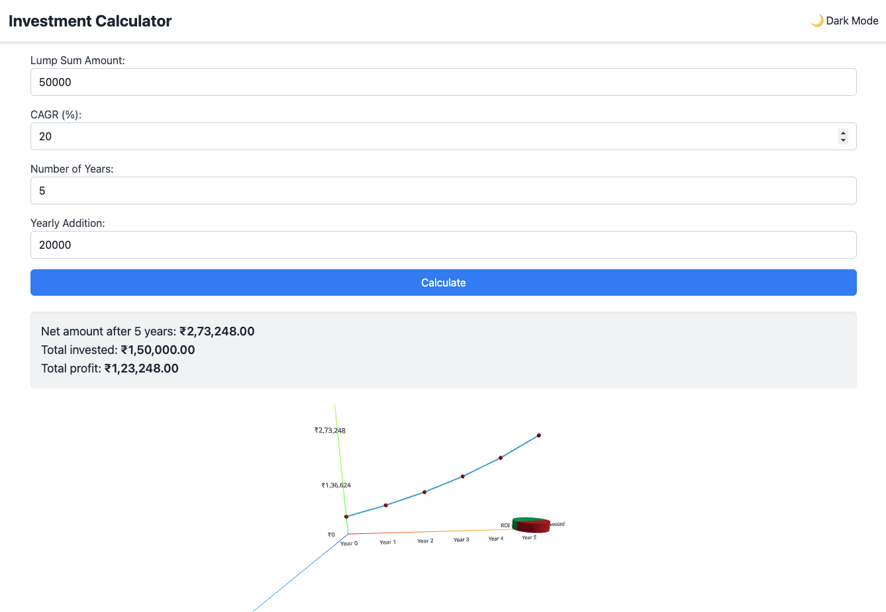
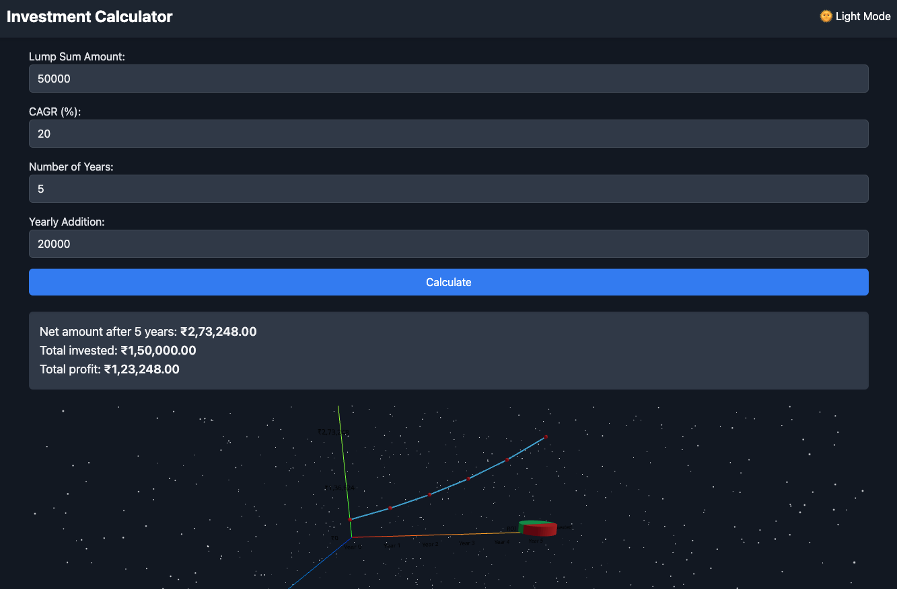

# Investment Calculator


## Table of Contents

- [Introduction](#introduction)
- [Features](#features)
- [Demo](#demo)
- [Technologies Used](#technologies-used)
- [Getting Started](#getting-started)
  - [Prerequisites](#prerequisites)
  - [Installation](#installation)
  - [Running Locally](#running-locally)
  - [Building for Production](#building-for-production)
  - [Deploying](#deploying)
- [Usage](#usage)
- [Project Structure](#project-structure)
- [Contributing](#contributing)
- [License](#license)
- [Acknowledgements](#acknowledgements)
- [Contact](#contact)

## Introduction

Welcome to the **Investment Calculator**! This web application allows users to calculate and visualize their investment growth over time based on various parameters such as lump sum investment, Compound Annual Growth Rate (CAGR), investment duration, and yearly additions. Leveraging modern web technologies, the application offers interactive 3D visualizations to provide a clear and engaging understanding of investment outcomes.

## Features

- **Real-Time Calculations:** Instant computation of investment growth based on user inputs.
- **Interactive 3D Visualizations:** Dynamic line and pie charts rendered using Three.js for an immersive experience.
- **Responsive Design:** Optimized for various device sizes, ensuring a seamless user experience on desktops, tablets, and mobile devices.
- **Dark Mode:** Toggle between light and dark themes for comfortable viewing in different environments.
- **Form Validation:** Robust input validation using React Hook Form and Yup to ensure accurate and meaningful calculations.
- **Accessibility:** Designed with accessibility in mind, ensuring usability for all users.

## Demo




## Technologies Used

- **Frontend:**
  - [React](https://reactjs.org/) - A JavaScript library for building user interfaces.
  - [Tailwind CSS](https://tailwindcss.com/) - A utility-first CSS framework for rapid UI development.
  - [React Hook Form](https://react-hook-form.com/) - For managing form state and validation.
  - [Yup](https://github.com/jquense/yup) - For schema validation.
- **3D Visualization:**
  - [Three.js](https://threejs.org/) - A JavaScript 3D library.
  - [@react-three/fiber](https://github.com/pmndrs/react-three-fiber) - A React renderer for Three.js.
  - [@react-three/drei](https://github.com/pmndrs/drei) - Useful helpers for react-three-fiber.
- **Deployment:**
  - [Firebase Hosting](https://firebase.google.com/products/hosting) - Fast and secure web hosting.

## Getting Started

Follow these instructions to set up and run the project locally on your machine.

### Prerequisites

Ensure you have the following installed on your machine:

- [Node.js](https://nodejs.org/) (v14 or higher)
- [npm](https://www.npmjs.com/) (comes with Node.js) or [Yarn](https://yarnpkg.com/)
- [Git](https://git-scm.com/)

### Installation

1. **Clone the Repository:**

   ```bash
   git clone https://github.com/yourusername/investment-calculator.git
   cd investment-calculator
   ```

2. **Install Dependencies:**

   Using npm:

   ```bash
   npm install
   ```

   Or using Yarn:

   ```bash
   yarn install
   ```

### Running Locally

Start the development server:

Using npm:

```bash
npm start
```

Or using Yarn:

```bash
yarn start
```

The application will run in development mode. Open [http://localhost:3000](http://localhost:3000) to view it in your browser. The page will reload if you make edits.

### Building for Production

Create an optimized production build:

Using npm:

```bash
npm run build
```

Or using Yarn:

```bash
yarn build
```

This will create a `build` directory with the production build of your app.

### Deploying

Deploy the application to Firebase Hosting.

1. **Install Firebase CLI:**

   Using npm:

   ```bash
   npm install -g firebase-tools
   ```

   Or using Yarn:

   ```bash
   yarn global add firebase-tools
   ```

2. **Login to Firebase:**

   ```bash
   firebase login
   ```

3. **Initialize Firebase in Your Project:**

   ```bash
   firebase init
   ```

   - Select **Hosting**.
   - Choose the existing Firebase project or create a new one.
   - Set `build` as the public directory.
   - Configure as a single-page app by replying **Yes**.
   - Do not overwrite `index.html` if prompted.

4. **Deploy to Firebase:**

   ```bash
   firebase deploy
   ```

   Your application will be deployed and accessible via the Firebase-provided URL.

## Usage

1. **Input Parameters:**
   - **Lump Sum Amount:** The initial investment amount.
   - **CAGR (%):** Compound Annual Growth Rate.
   - **Number of Years:** Duration of the investment.
   - **Yearly Addition:** Additional investment made at the end of each year.

2. **Calculate:**
   - Click the **Calculate** button to view the investment growth and distribution.

3. **View Results:**
   - **Net Amount:** Total investment value after the specified duration.
   - **Total Invested:** Sum of the initial investment and yearly additions.
   - **Total Profit:** Net amount minus the total invested.

4. **Visualizations:**
   - **Line Chart:** Displays the growth of the investment over the years.
   - **Pie Chart:** Shows the distribution between the invested amount and the return on investment (ROI).

5. **Toggle Dark Mode:**
   - Use the toggle button in the header to switch between light and dark themes.

## Project Structure

```
investment-calculator/
├── public/
│   ├── index.html
│   └── favicon.ico
├── src/
│   ├── assets/
│   │   └── images/
│   │       └── logo.png
│   ├── components/
│   │   ├── Header.jsx
│   │   ├── Footer.jsx
│   │   ├── InvestmentForm.jsx
│   │   ├── ResultDisplay.jsx
│   │   ├── Visualization.jsx
│   │   ├── LineChart.jsx
│   │   ├── PieChart.jsx
│   │   └── ErrorBoundary.jsx
│   ├── hooks/
│   │   └── useDarkMode.js
│   ├── styles/
│   │   └── globals.css
│   ├── utils/
│   │   └── calculations.js
│   ├── App.jsx
│   ├── index.js
│   └── setupTests.js
├── .gitignore
├── package.json
├── postcss.config.js
├── tailwind.config.js
├── README.md
└── yarn.lock / package-lock.json
```

## Contributing

Contributions are welcome! Please follow these steps:

1. **Fork the Repository**

2. **Create a New Branch:**

   ```bash
   git checkout -b feature/YourFeatureName
   ```

3. **Commit Your Changes:**

   ```bash
   git commit -m "Add your detailed description of the feature"
   ```

4. **Push to the Branch:**

   ```bash
   git push origin feature/YourFeatureName
   ```

5. **Open a Pull Request**

Please ensure your code adheres to the project's coding standards and passes all linting and testing checks.

## License

This project is licensed under the [MIT License](./LICENSE).

## Acknowledgements

- [React](https://reactjs.org/)
- [Three.js](https://threejs.org/)
- [@react-three/fiber](https://github.com/pmndrs/react-three-fiber)
- [@react-three/drei](https://github.com/pmndrs/drei)
- [Tailwind CSS](https://tailwindcss.com/)
- [React Hook Form](https://react-hook-form.com/)
- [Yup](https://github.com/jquense/yup)
- [Firebase Hosting](https://firebase.google.com/products/hosting)

## Contact

Made with ❤️ by [**Krishna Purwar**](https://www.linkedin.com/in/i183x/)

---
